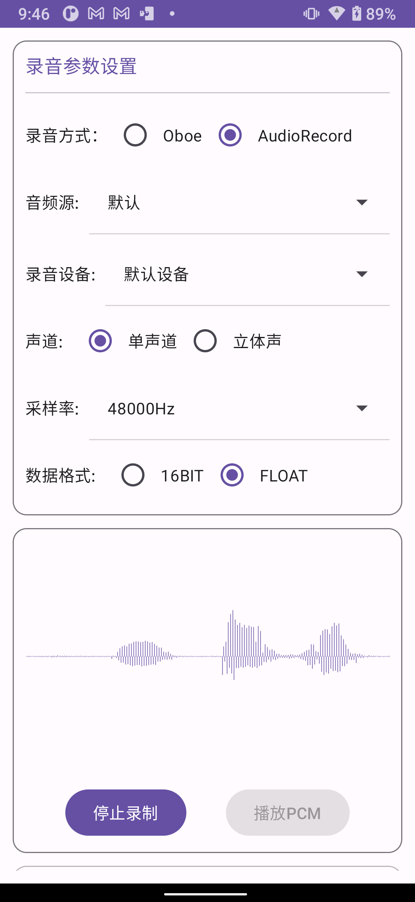

# Android 音频录制演示项目

这是一个使用Oboe和Android原生音频API实现的录音演示项目，可以实时绘制录音波形。

## 功能特性

- 音频录制与播放
- 支持可配置的录音参数：
  - 声道选择（单声道/立体声）
  - 采样率选择（8kHz/16kHz/44.1kHz/48kHz）
  - 数据格式选择（PCM_16BIT/PCM_FLOAT）
  - 录音设备
- 实时录音波形显示
- PCM格式音频文件的播放功能

## 权限要求

应用需要以下权限：
- `RECORD_AUDIO`: 用于录制音频
