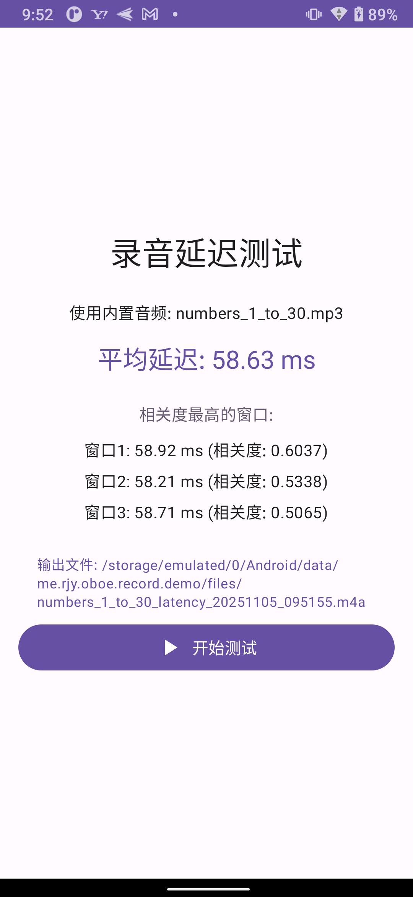

# Android 音频录制演示项目

[English](README.md) | 中文

这是一个使用 Oboe 和 Android 原生音频 API 实现的音频录制与处理演示项目，提供了丰富的音频录制、播放和测试功能。

## 功能特性

### 🎙️ 音频录制功能

#### 录音方式选择

- **Oboe 录音**：使用 Google Oboe 库进行高质量录音，支持低延迟
- **AudioRecord 录音**：使用 Android 原生 AudioRecord API

#### 丰富的录音参数配置

- **声道选择**：单声道 / 立体声
- **采样率**：8kHz / 16kHz / 44.1kHz / 48kHz
- **数据格式**：PCM_16BIT / PCM_FLOAT
- **音频源**：默认、麦克风、语音通话、语音识别、摄像机、未处理、演出等
- **录音设备**：支持选择内置麦克风、USB 设备、蓝牙设备、有线耳机等
- **音频 API**（仅 Oboe 模式）：Unspecified / AAudio / OpenSL ES

#### 实时波形显示

- 录音时实时显示音频波形
- 单声道模式显示单个波形图
- 立体声模式分别显示左右声道波形
- 播放时显示播放波形和进度条

#### PCM 文件管理

- 自动生成带参数信息的文件名（包含录音方式、声道、采样率、格式等）
- 文件列表管理，支持查看和选择已录制的 PCM 文件
- 支持删除录音文件（长按进入编辑模式）
- 显示录音文件路径，支持一键复制路径

### 🎵 音频播放功能

#### 播放方式选择

- **Oboe 播放**：使用 Oboe 库进行低延迟播放
- **AudioTrack 播放**：使用 Android 原生 AudioTrack API

#### PCM 文件播放

- 自动从文件名解析播放参数（声道、采样率、格式）
- 支持播放录制的 PCM 文件
- 播放时显示波形和播放进度
- 播放完成后自动清理资源

### 📊 录音延迟测试

- 自动检测录音延迟
- 显示平均延迟时间
- 显示最高相关性的延迟窗口信息（Top 3）
- 生成延迟测试录音文件（M4A 格式）
- 支持播放和分享测试结果文件
- 自动清理旧的测试文件（保留最新 20 个）

### 🎬 本地播放器

- 支持本地音频/视频文件播放功能

### ⚙️ 其他特性

- **参数持久化**：自动保存和恢复录音参数设置
- **设备动态监听**：自动检测音频设备插拔并刷新设备列表
- **错误处理**：友好的错误提示和处理机制
- **现代化 UI**：使用 Jetpack Compose 构建，支持横竖屏自适应
- **文件分享**：支持通过系统分享功能分享录音文件
- **多语言支持**：支持英文、中文、日文

## 技术栈

- **开发语言**：Kotlin
- **UI 框架**：Jetpack Compose
- **音频库**：Oboe、Android AudioRecord/AudioTrack
- **原生代码**：C++ (JNI)
- **架构模式**：MVVM (ViewModel + LiveData)

## 权限要求

应用需要以下权限：

- `RECORD_AUDIO`：用于录制音频
- `READ_MEDIA_AUDIO` / `READ_EXTERNAL_STORAGE`：用于读取媒体文件（Android 13+ / 旧版本）

## 截图

  
  &nbsp;&nbsp;
  

